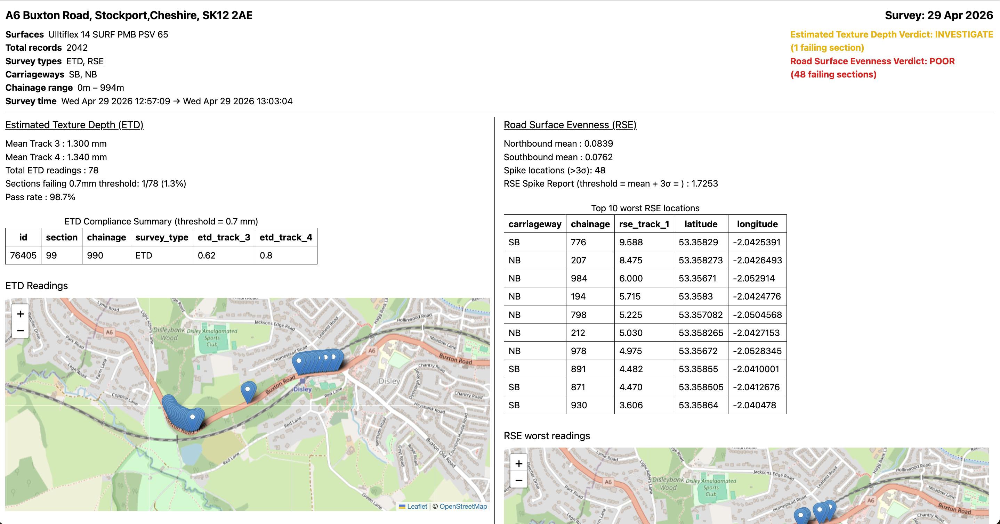
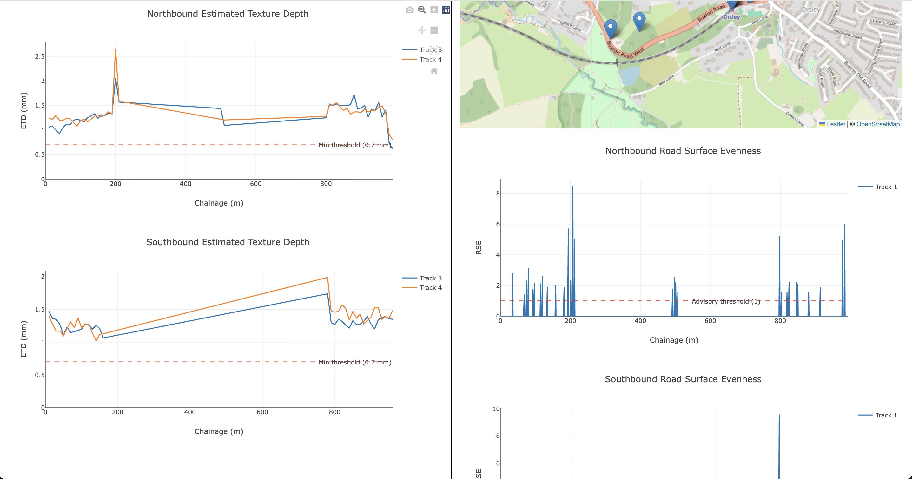

# Description

- Dashboard for analysing Road Surface Evenness and Estimated Texture Depth from road survey data




# Setup

- ```cd ssi-survey```
- ```npm i```
- ```npm run dev```


# Methodology

- Agentic LLM for the python data analysis


# Sources

- https://www.shedloadofcode.com/blog/exploratory-data-analysis-with-danfojs-and-javascript
- https://www.durabast.de/durabast/EN/Reference/LT/LT_node.html
- https://study.com/skill/learn/determining-outliers-using-standard-deviation-explanation.html